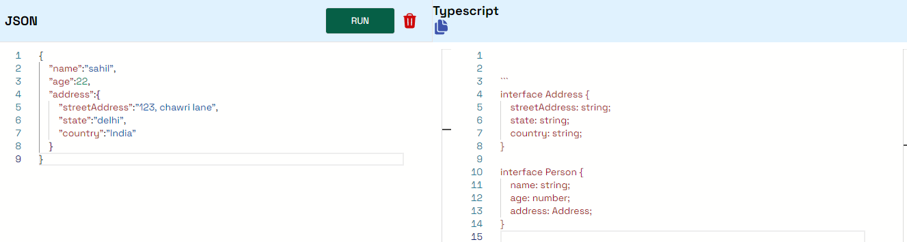

# json-to-typescript

## description

a web application that converts JSON objects to Typescript interfaces using the ChatGPT API.

## Usage

### client

- create a `.env` file
- add `REACT_APP_API_URL` as `http://localhost:5000`.
- run `npm i` to install dependencies
- finally, run `npm start` to start the project

Visit `http://localhost:3000` in your browser.

### server

- create a `.env` file
- Generate an API KEY at [OpenAi](https://platform.openai.com/) and add it to the .env file as `OPEN_AI_API_KEY`.
- run `npm i` to install dependencies
- run `npm run build` to build the project
- finally, run `npm start` to start the project

The endpoint is at `POST` http://localhost:5000/api/convert.
